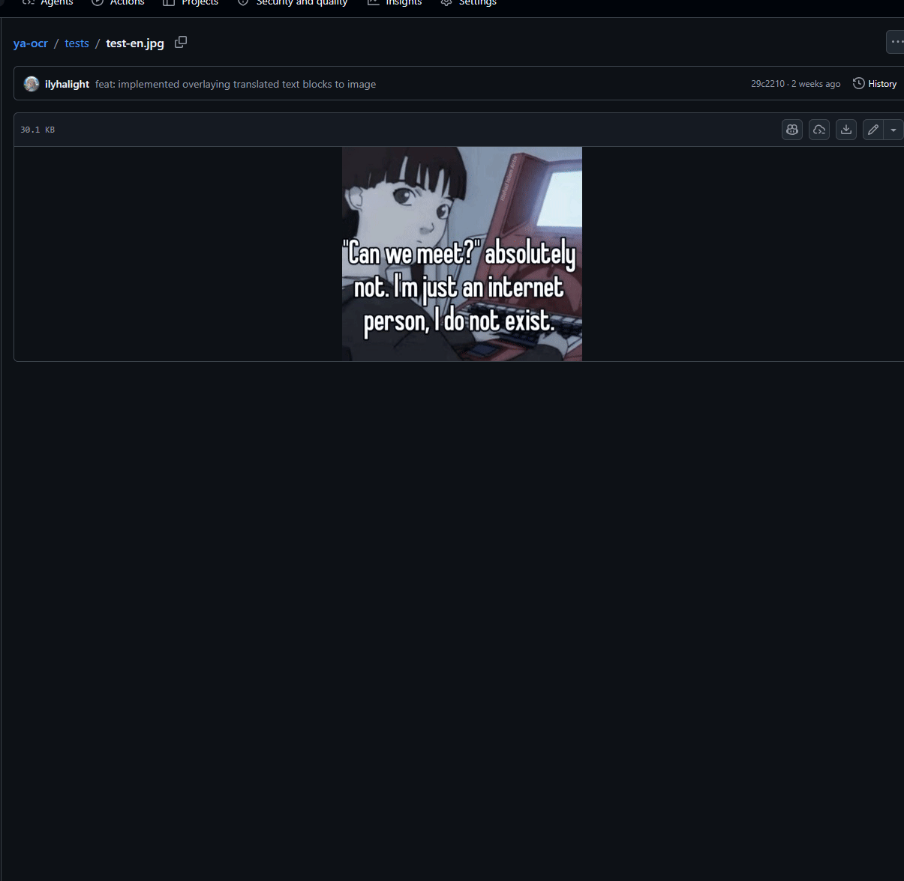

[badge-firefox]: https://img.shields.io/amo/v/translate-image
[badge-chrome]: https://img.shields.io/chrome-web-store/v/mfbjdcajnhcdbclbibbmjanmofmnpdnc
[firefox-link]: https://addons.mozilla.org/ru/firefox/addon/translate-image
[chrome-link]: https://chromewebstore.google.com/detail/mfbjdcajnhcdbclbibbmjanmofmnpdnc

# Translate Image Browser Extension

[![Firefox downloads][badge-firefox]][firefox-link]
[![Chrome Web Store version][badge-chrome]][chrome-link]

Browser extension for Chromium and Firefox that translates text in images using OCR and swaps the image source directly on the page.

Translate pair: `auto` -> `ru` (auto-detected source language to Russian).

## Features

- Adds a context menu action on images: **Toggle image translate**.
- Runs OCR + translation through Yandex endpoints (via `ya-ocr`).
- Toggles translated/original image on repeated clicks.
- Caches translated results by image URL in memory for faster repeated use.

## How It Works

1. Right-click an image and choose **Toggle image translate**.
2. Background script sends the image URL to OCR client.
3. Returned translated SVG is converted to a `data:image/svg+xml;base64,...` URL.
4. Content script replaces every matching `` element on the page.
5. Repeating the action restores the original image.

## Install the Extension

- [Install for Firefox][firefox-link]
- [Install for Chrome][chrome-link]

> **Availability:** If the Store listing is unavailable, the extension is still being reviewed by the store. Please try again later.

## Requirements

- [Bun](https://bun.sh/)

## Development Setup

```bash
bun install
```

## Development

Start extension development build:

```bash
bun run dev
```

Start Firefox development build:

```bash
bun run dev:firefox
```

## Build

Build production package:

```bash
bun run build
```

Build for Firefox:

```bash
bun run build:firefox
```

The unpacked builds are written to `.output/chrome-mv3` and `.output/firefox-mv2`, respectively. Load `.output/chrome-mv3` as an unpacked extension in a Chromium browser, or load `.output/firefox-mv2/manifest.json` as a temporary add-on in Firefox.

Create ZIP package:

```bash
bun run zip
```

Create Firefox ZIP package:

```bash
bun run zip:firefox
```

ZIP archives are written to `.output/`.

## Type Check

```bash
bun run compile
```

## Permissions

The extension requests:

- `contextMenus` to add image context action.
- `activeTab` and `scripting` to inject content script on demand.
- `declarativeNetRequest` to adjust request headers for OCR/translate endpoints.
- `host_permissions: ["<all_urls>"]` to work on any site.

## Project Structure

```text
src/
	entrypoints/
		background.ts   # context menu + OCR request + toggle message
		content.ts      # image replacement and restore logic
	utils/
		fetch.ts        # declarativeNetRequest session rule
		messaging.ts    # typed message protocol between scripts
```

## Limitations

- `file:`, and `data:` image URLs cannot be submitted for translation; images already translated by the extension can still be restored.
- The translated-image cache lasts only for the current background-script lifetime.
- Translation quality depends on source image quality and OCR recognition.

## Tech Stack

- [WXT](https://wxt.dev/) for extension development/build.
- TypeScript.
- `@webext-core/messaging` for typed extension messaging.
- `ya-ocr` client for OCR + translation requests.

## Preview


